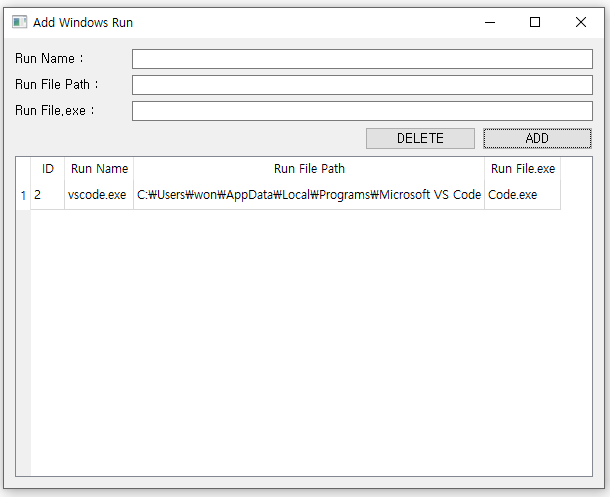
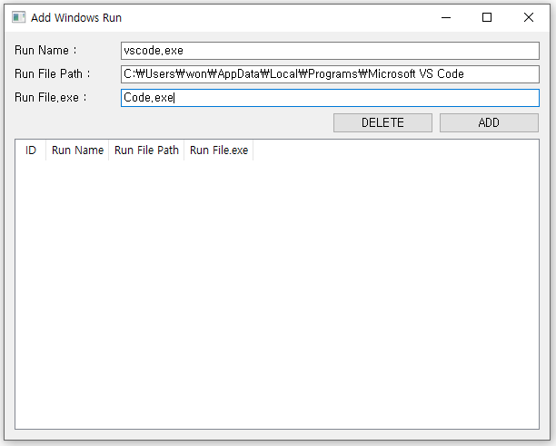
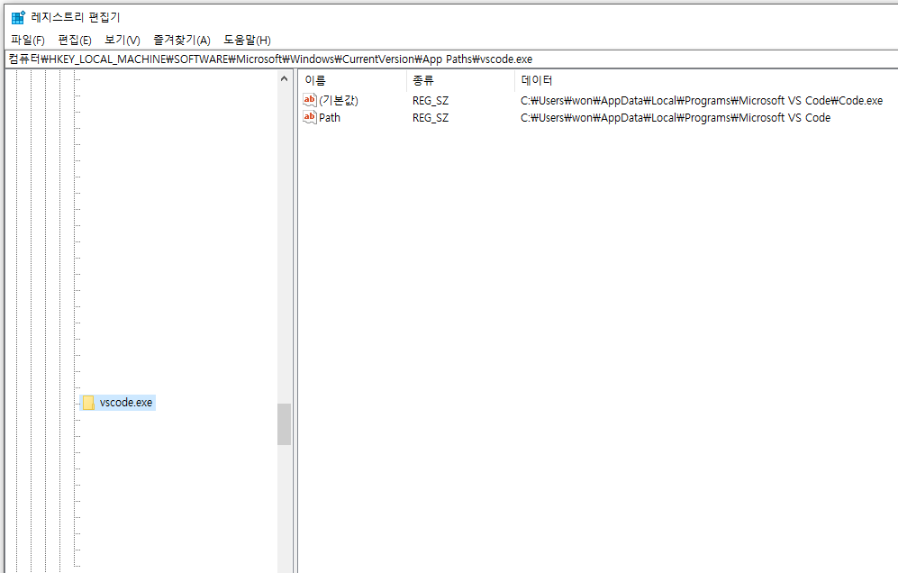
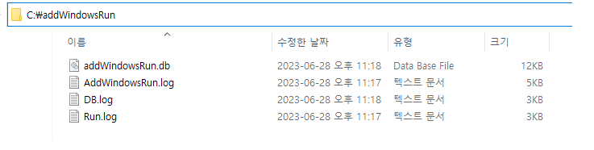

# Add Windows Run

## 1. 소개

Windows의 실행에서 파일을 실행할 수 있도록 등록 및 관리하는 프로그램

사용언어 - Python

사용 DB - SqlLite

## 2. 기능

- 실행할 파일 레지스트리에 추가
- 추가한 파일 삭제

## 3. 사용방법

1. 추가

- Run Name :
  - 실행에서 파일을 실행할 명령어 등록 ex) vscode.exe
- Run File Path : 
  - 실행 파일이 위치한 폴더 경로 ex) C:\Users\VSCode
- Run File.exe :
  - 실제 exe 파일 ex) Code.exe

2. 삭제

- 삭제할 항목 클릭 후 Delete 버튼 클릭

3. 확인

- 실행창에서 등록한 명령어를 통해 실행확인

- 레지스트리편집기에서 추가 및 삭제 확인

4. 실행 및 실패 로그는 4번의 DB 및 Log경로에서 확인가능

## 4. DB 및 Log 경로

C:\addWindowsRun

- DB.log
  - DB 실행 로그
- AddWindowsRun.log
  - 프로그램 시작 로그
- Run.log
  - 실행 로그
- addWindowsRun.db
  - 추가한 파일 및 경로를 저장하는 DB

